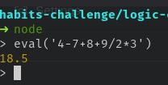

# Prueba lógica

Instalar dependencias y ejecutar pruebas unitarias:

```bash
npm install && npm test
```

# Solución

Para este reto de lógica, traté de usar un enfoque de programación funcional, dado que todas las funciones pertinentes iban a estar trabajadas sobre un _string_, me pareció una mejor idea el manejar el flujo mediante un _pipe_, pues así podría manejar en funciones separadas el procesamiento del _string_ teniendo que todas las funciones deberían tener la misma entrada y salida. Esto permite, como podrán notar, el extender o acotar la funcionalidad como se desee, pues un claro ejemplo es que modificando únicamente dos estructuras de datos se pueden quitar o agregar más operaciones.

Respecto al reto que representó el algoritmo, lo primero fue definir el flujo 

`validar longitud -> tokenizar por operación -> ejecutar operaciones -> acumular los resultados -> devolver resultado`

una vez denfido el flujo, como mencioné anteriormente, lo implementé para que sea cerrado a modificaciones y abierto a extensiones, por eso, tomé las siguientes decisiones en las siguientes partes del flujo:

- Tokenizer: Esta parte consiste en separar la cadena de texto por operador (suma, resta, división, etc.) para esto lo que se me hizo más útil fueron las expresiones regulares, por eso cree una estructura de datos que mantiene la jerarquía de operaciones y en tal orden se separan las operaciones para posteriormente ejecutar las operaciones.
- Ejecución de operaciones: Esta parte se encarga de ejecutar las operaciones dependiendo del operador (*,-,/, etc.) para esto, aproveché las bondades de JS en los objetos, usándolo como validación en lugar de usar un if o switch y tener, tal vez, el doble de código.

Respecto a los resultados y las pruebas, me di cuenta hay un error, pues cuando suma números positivos y negativos hace la suma sin importar el signo de un nḿero, por ejemplo: `-11 + 13.5 = -24.5` cuando debería ser `2.5`, este error no tuve el tiempo de indagar de cómo solucionarlo. Pero, de igual manera, me di cuenta que el resultado varía dependiendo cuando hay más de una operación del mismo nivel, por ejemplo en `4-7+8+9/2*3` el reto dice que el resultado es `6.5`, pero dependiendo de si haces la multiplicación o la división primero, el resultado varia, al menos el motor de node arroja el siguiente resultado:



Finalmente, no estoy muy seguro cuál resultado es al que debo confiar para guiarme de el y realizar ajustes del reto para que arroje el resultado correcto.